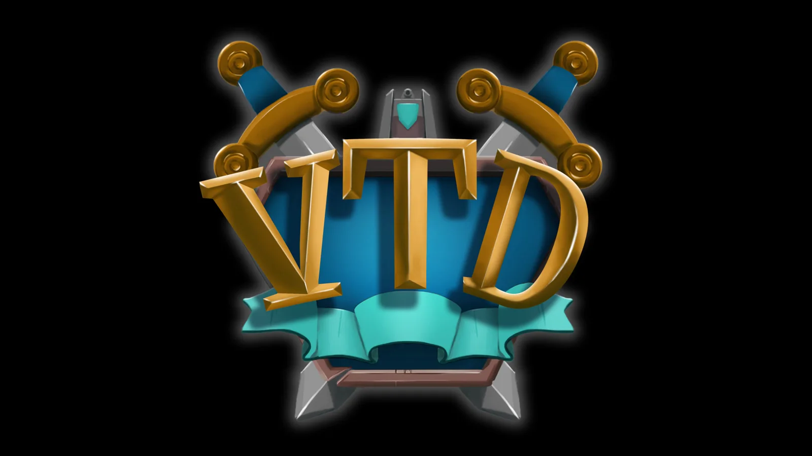
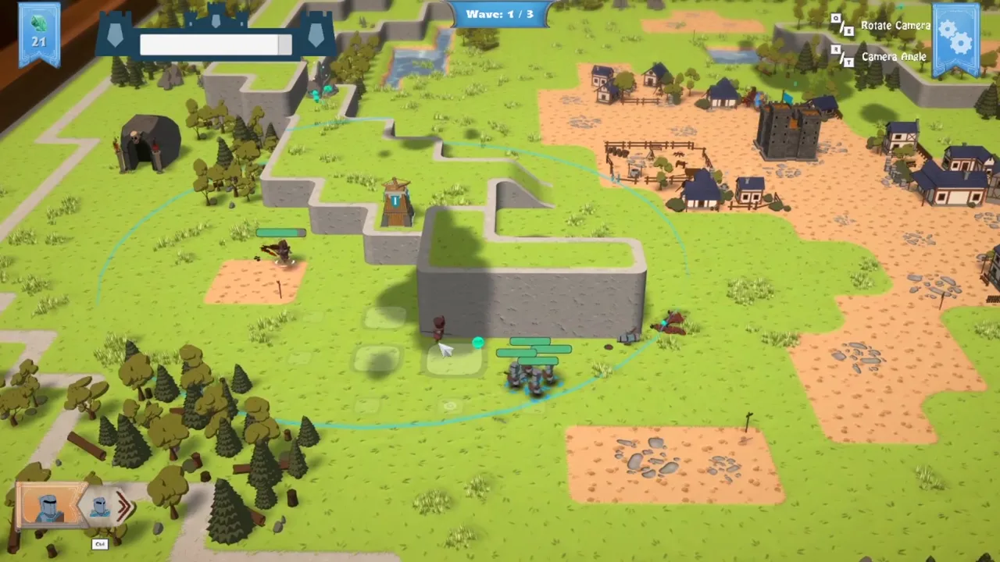

<h1 align="center">🏰 5TD</h1>

  

  <strong>A real-time strategy and tower-defence prototype built in Unity.</strong> 
  Command squads, construct defences, manage resources, and survive enemy waves across a tabletop campaign.

  
  
  
  
  

  <a href="https://drive.google.com/file/d/1HBuVKyWop0EiN7ZbtbKt64ulLq0-rSvA/view"><strong>Watch the Trailer (1:04)</strong></a>
  ·
  <a href="https://www.linkedin.com/in/christopher-bonetto-547876221"><strong>LinkedIn</strong></a>

  

A player-controlled squad defending the map during an enemy wave. Click the image to watch the trailer.

## 📌 Project Snapshot

| | |
|---|---|
| **Role** | Gameplay & Systems Programmer |
| **Engine** | Unity 2019.2.0f1 |
| **Language** | C# |
| **Team** | Human Factor — 13 people, including 3 programmers |
| **Development** | 2019–2020 academic production cycle |
| **Platform** | Windows PC |
| **Status** | Completed team project; archived portfolio copy |

## 🎮 Overview

*5TD*, developed under the earlier working title *Good North*, is a real-time strategy and tower-defence prototype created by the 13-person Human Factor student team. The player directs squads, constructs and upgrades defensive buildings, manages resources, and survives scripted enemy waves across a multi-level campaign selected from a 3D war room.

My work focused on the gameplay and runtime architecture connecting entities, allied and enemy units, AI, game states, progression, input, tools, persistence, pooling, events, and audio. It is my strongest Unity example of responsibility across several interacting systems in a multidisciplinary production.

## 🕹️ How to Play

Build and upgrade defences, direct your squads, and protect your territory through successive enemy waves. Resources are used to construct buildings and produce or improve units, while each level introduces a different tactical layout.

| Input | Action |
|---|---|
| `WASD` / Arrow Keys | Move the camera |
| Move cursor to screen edge | Pan the camera |
| Mouse Wheel | Zoom |
| Left Mouse Button | Select units, buildings, or interface elements |
| Hold Left Mouse Button + drag | Rotate the camera freely |
| Right Mouse Button | Move, attack, or interact with the selected squad |
| `Q` / `E` | Rotate the camera |
| `R` / `T` | Adjust the camera angle |
| `Tab` | Focus the camera on a troop |
| `1`–`0` | Focus the camera on registered buildings |

The game also provides contextual interface hints and a tutorial flow for its core commands.

## 👨‍💻 My Contributions

I worked as one of three programmers in a multidisciplinary team. My documented contributions include:

- Designed a **ScriptableObject-driven game-state flow** covering startup, war room, level initialization, gameplay, pause, and level completion.
- Built the **level and scene-management pipeline**, including level metadata, progression state, transitions, and runtime initialization.
- Designed and implemented the complete **allied and enemy troop gameplay layer**.
- Built an **entity-as-squad architecture**, where each controllable troop coordinates a swarm of individual units.
- Implemented unit statistics, health, damage, navigation, formation and swarm positioning, target acquisition, combat engagement, melee and ranged attacks, hit reactions, and death behaviour.
- Authored the project-specific **Behavior Designer tasks, trees, shared variables, and integrations** used by allied and enemy troop AI.
- Developed expandable **object pools** for troops, buildings, and reusable gameplay objects.
- Created data-driven **unit and building definitions** with runtime statistic copies, allowing upgrades without mutating source assets.
- Implemented mouse and keyboard **selection, commands, camera control, and camera targeting**.
- Implemented a reusable **command system with execution and undo support** for controllable entities.
- Built a custom **Entity Designer editor window** and validation-oriented inspectors.
- Implemented save/load support for player identity and level progression.
- Developed a typed event bus that decouples game state, UI, sound, input, entities, and wave systems.
- Integrated **FMOD Studio** through custom wrappers for events, banks, instances, parameters, and buses.

The repository preserves the original team development history and identifies later portfolio-migration changes separately. I present the project as collaborative work and do not claim sole authorship.

## ⚙️ Technical Highlights

### State and event flow

`HFGameManager` validates transitions between ScriptableObject state definitions and broadcasts changes through `HFEventManager`. UI, audio, scenes, input, entities, and wave systems subscribe independently, reducing direct coupling between managers.

### Squad-based entities and combat

`EntityBehavior` supplies shared command, damage, attack, selection, pause, and target behaviour. A `Troop` acts as the controllable entity and coordinates a swarm of individual `Unit` instances, including formation positions, navigation, runtime statistics, health, target selection, combat states, attacks, reactions, and death.

### Behaviour Tree AI

The project uses the external **Behavior Designer** plugin as its Behaviour Tree editor and runtime. I authored the game-specific trees, tasks, shared variables, and integrations that connect it to troop movement, targeting, and combat; I do not claim authorship of the plugin itself.

### Data-driven entities

Units and buildings are described by ScriptableObject statistic assets. `GameCollection` creates runtime copies so upgrades and temporary changes do not alter the source data, while `GameController` resolves costs, resources, spawn positions, layers, and pooled instances.

### Content-authoring tools

The project includes a custom workflow for generating and validating entity definitions, plus a layered tilemap pipeline that converts authored maps into optimized 3D level content.

## ✨ Project Features

- Squad-based movement and combat using NavMesh navigation.
- Constructible and upgradeable defensive buildings.
- Resource gathering, spending, and unit production.
- Configurable single, timed, and bulk enemy-wave behaviours.
- Multi-level campaign flow and a 3D war-room level selector.
- Data-driven unit, building, level, and wave configuration.
- Layered tilemap-to-3D map-generation tooling.
- HUD, pause, tutorial, victory, and defeat flows.
- Cinemachine camera control, Lightweight Render Pipeline rendering, and FMOD audio.

## 🛠️ Technology

- Unity 2019.2.0f1
- C#
- ScriptableObjects
- Unity NavMesh and Tilemaps
- Behavior Designer with project-specific tasks
- Lightweight Render Pipeline 6.9.1
- Cinemachine 2.5
- FMOD Studio integration
- DOTween
- TextMesh Pro and UGUI

## 🎬 Media

- [Project trailer (1:04)](https://drive.google.com/file/d/1HBuVKyWop0EiN7ZbtbKt64ulLq0-rSvA/view)

The trailer shows the war room, tabletop campaign map, troop and building controls, wave and resource UI, and active combat. The images in this README were extracted from that trailer.

## 🚀 Build and Running the Project

This repository preserves the complete Unity project rather than generated caches or a prebuilt executable.

1. Install Unity **2019.2.0f1** through Unity Hub.
2. Clone the repository with [Git LFS](https://git-lfs.com/) installed.
3. Open the repository root as a Unity project.
4. Allow Package Manager to restore the versions recorded in `Packages/manifest.json`.
5. Open `Assets/Scenes/GameScenes/SCN_Start.unity` and enter Play Mode, or create a Windows build from the scenes already configured in Build Settings.

A verified prebuilt Windows portfolio build can be added later without changing the source archive.

## 🧭 Project Context

- **Context:** Academic multidisciplinary team production
- **Team:** Human Factor — 3 programmers, 3 game designers, 3 2D artists, and 4 3D artists
- **My position:** One of three programmers
- **Repository history:** Original team development history preserved; later portfolio migration and dependency archival changes identified separately

## 👥 Credits, Ownership and Status

*5TD* was created collaboratively by Human Factor and was developed under the earlier working title *Good North*. Third-party tools and assets remain the property of their respective authors.

> This repository is shared for portfolio review. It documents my contribution to a collaborative project and does not grant permission to reuse third-party or team-owned assets. Unless stated otherwise, it is not an open-source release.

**Project status:** Completed academic team project; no longer actively maintained.

## 💼 Contact

[LinkedIn — Christopher Bonetto](https://www.linkedin.com/in/christopher-bonetto-547876221)
